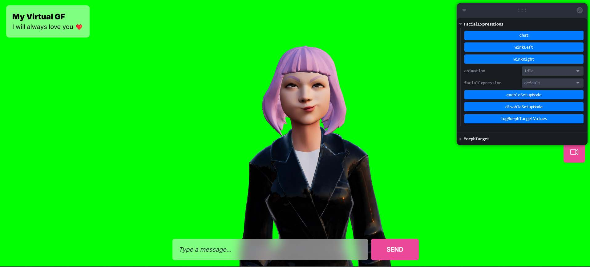
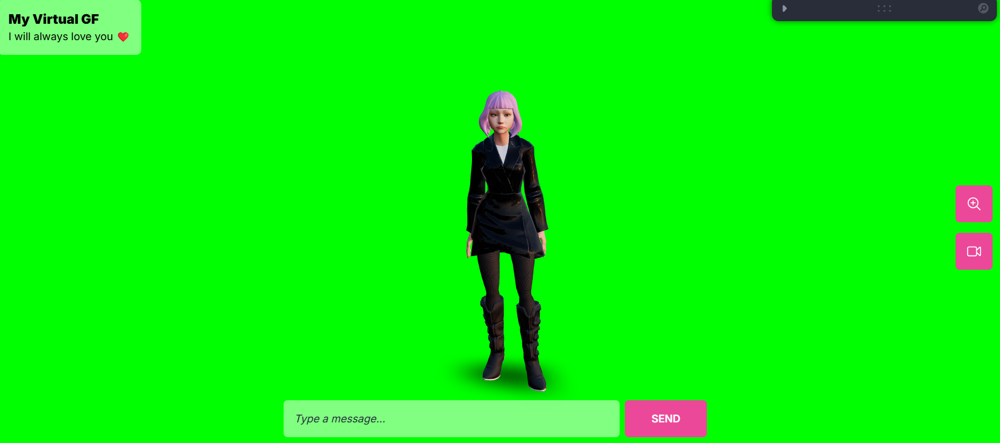
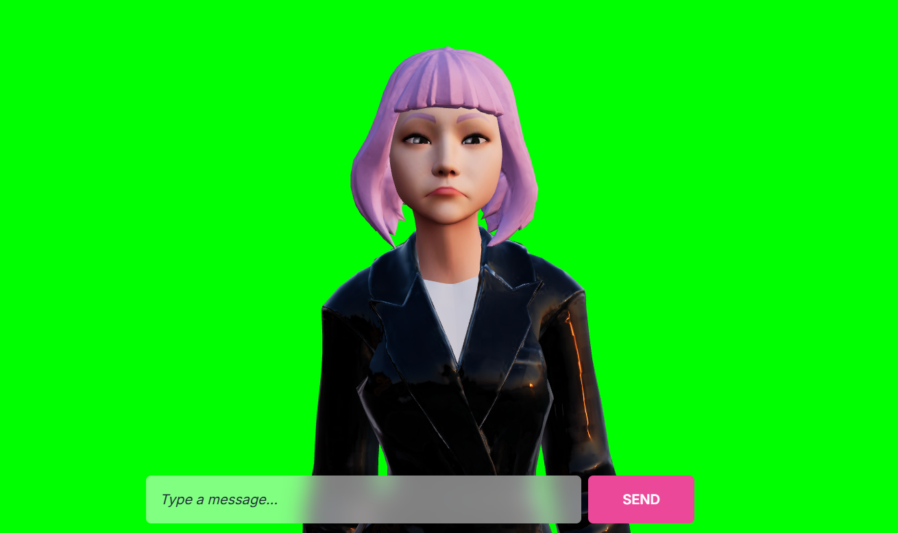

# 🦊 My AI Girlfriend (Fox Edition) 

**A pawsome fork** of Wawa Sensei's tutorial project, but with more fluff! This version is **100% free** (because foxes hate paying for stuff), powered by **Google Gemini** for brains, **ElevenLabs** for a sassy voice (free tier, baby!), and **Rhubarb Lip Sync** to make sure her muzzle moves when she roasts you. 

<iframe width="560" height="315" src="https://www.youtube.com/embed/hihXR_KsY_Q?si=QJMLpNs4VCATRBwP" title="YouTube video player" frameborder="0" allow="accelerometer; autoplay; clipboard-write; encrypted-media; gyroscope; picture-in-picture; web-share" referrerpolicy="strict-origin-when-cross-origin" allowfullscreen></iframe>

[](https://www.youtube.com/watch?v=hihXR_KsY_Q)
*Click the gif to watch her in action! (she might demand virtual treats)*





## Why This Fox is Cooler 🦊✨

- **FREE. AS. A. BIRD.** (Or a fox stealing chicken from a coop)  
- **Actual lip-syncing!** No more creepy ventriloquist doll vibes.  
- **Zoomable fox camera** because sometimes you need personal space.  
- **Green screen mode** for maximum meme potential.  
- **She's a fox**. Need I say more?

## Get the 3D Avatar

Pour importer l'avatar 3D dans votre projet React, utilisez cette commande :

```bash
npx gltfjsx@6.2.3 public/models/64f1a714fe61576b46f27ca2.glb -o src/components/Avatar.jsx -k -r public
```

Cela créera un composant React optimisé pour utiliser le modèle 3D de la renarde.

## Pre-requisites (Don't skip this or the fox gets grumpy)

1. **🦊 Google Gemini API Key**  
   - Get it here: [AI Studio](https://aistudio.google.com/app/apikey)  
   - Create a `.env` file in `code-back` with:  
     ```env
     GEMINI_API_KEY=your_key_here
     ```

2. **🎤 ElevenLabs API Key** (Free tier = 9 mins/month. Use wisely!)  
   - Grab it here: [ElevenLabs API Settings](https://elevenlabs.io/app/settings/api-keys)  
   - Add to `code-back/.env`:  
     ```env
     ELEVEN_LABS_API_KEY=your_key_here
     ```

3. **💋 Rhubarb Lip Sync**  
   - **Windows**:  
     - Download [v1.13.0 Release](https://github.com/DanielSWolf/rhubarb-lip-sync/releases/tag/v1.13.0)  
     - Extract, add the folder to your **System PATH** (Google it if you must 🦊)  
   - **Linux**:  
     - Create a `bin` folder at project root  
     - Place Linux Rhubarb files in `bin`  
     - Pray to the open-source gods 🧘  

4. **🎥 FFmpeg**  
   - Install it. Add it to PATH. Do it for the fox.  
   - [FFmpeg Official Guide](https://ffmpeg.org/download.html)

## Running the Den 🏃♂️💨

1. **Backend** (Where the fox magic happens):  
   ```bash
   cd code-back
   yarn install
   yarn dev
   ```

2. **Frontend** (Where you stare at the fox):  
   ```bash
   cd code-front
   yarn install
   yarn dev
   ```

## FAQ (Frequently Asked by Foxes)

**Q: Her lips aren't moving!**  
A: Did you install Rhubarb? Set the PATH? Restart everything? Offer a virtual grape?  

**Q: "rhubarb" command not found!**  
A: Windows: PATH issue. Linux: Did you put it in `/bin` and update the backend code?  

**Q: She's ignoring me!**  
A: Check your API keys. Maybe she's just playing hard to get.  

**Q: Can I deploy this?**  
A: Sure! But remember:  
- Linux servers need Rhubarb in `bin`  
- Set ENV variables properly  
- Free tiers have limits (don't make the fox beg)  

## Code Structure (For Nerdy Foxes)

```lua
├───.qodo
├───code-back
│   ├───.qodo
│   ├───audios
│   └───bin
│       ├───extras
│       │   ├───AdobeAfterEffects
│       │   ├───EsotericSoftwareSpine
│       │   └───MagixVegas
│       ├───include
│       │   ├───gmock
│       │   │   └───internal
│       │   │       └───custom
│       │   └───gtest
│       │       └───internal
│       │           └───custom
│       ├───lib
│       │   ├───cmake
│       │   │   └───GTest
│       │   └───pkgconfig
│       ├───res
│       │   └───sphinx
│       │       └───acoustic-model
│       └───tests
│           └───resources
├───code-front
│   ├───.qodo
│   ├───public
│   │   ├───animations
│   │   └───models
│   └───src
│       ├───assets
│       ├───components
│       └───hooks
└───screens
```

## Final Note from the Fox 🦊

This project is held together by virtual duct tape and fox magic. Things might break. Embrace the chaos.  

P.P.S. Star this repo or the fox will steal your cookies.*  

*Made with 🦊 and a questionable amount of caffeine.*